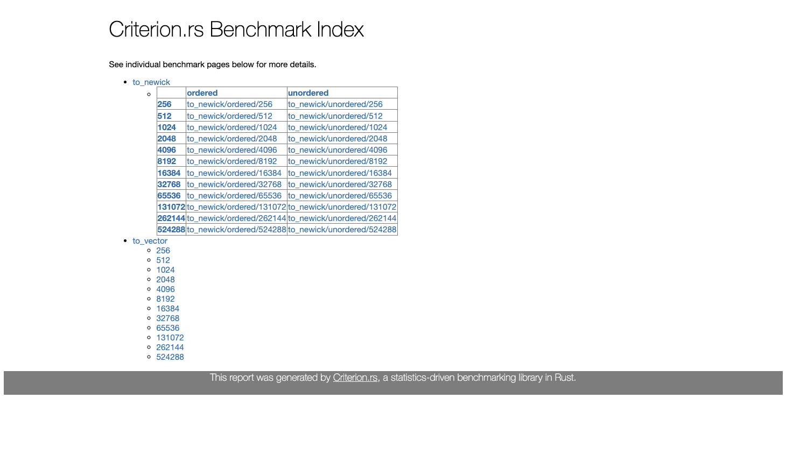
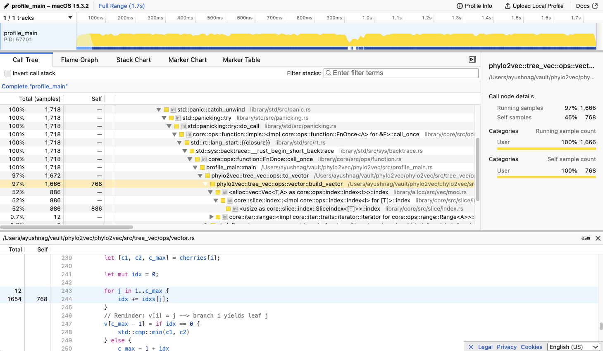

# Development guide

The core logic of `phylo2vec` is implemented in Rust. The Rust code is accessed
by other languages like Python and R using bindings. The main installable Python
package will contain a hybrid of native Python code and Rust bindings.

## Structure of the codebase

`docs`: Jupyterbook documentation for phylo2vec. Includes this development
guide, example notebooks, and the API reference.

`phylo2vec`: The Rust codebase for phylo2vec. This is where the core logic of
phylo2vec is implemented.

`py-phylo2vec`: The Python codebase for phylo2vec. The Python package uses a
combination of Rust bindings and native Python code to provide the core logic of
phylo2vec.

`py-phylo2vec/src/lib.rs`: Python bindings for the Rust code. The module
containing the compiled bindings is called `_phylo2vec_core`.

`py-phylo2vec/phylo2vec`: Definition of the phylo2vec python API. Most functions
are implemented using the Rust bindings via `_phylo2vec_core`. However some have
not been ported over yet and contain logic written in Python.

`r-phylo2vec`: The R codebase for phylo2vec. Follows a similar structure to the
Python package. The R package uses the `extendr` library to create bindings for
the Rust code.

## Pixi

Pixi is used to compile the Rust code, create Python and R bindings, and install
the package. It simplifies the process of creating and managing multi-language
packages. There are base commands such as `test`, `benchmark`, `install` that
have been defined for each language, each with the necessary steps to run the
tests, benchmarks, and install the package. You should be able to find a pixi
command for most of the tasks you need to do or you can define one yourself in
the `pixi.toml`. You can also run arbitrary commands directly from the command
line using `pixi run -e <environment> <command>`. For example:

```console
pixi run -e py-phylo2vec pytest -k "test_to_newick_ordered[256]"
```

## Testing

To run the unit test suite, you can run the following Pixi commands

```console
pixi run -e default test # Rust tests
pixi run -e py-phylo2vec test # Python tests
pixi run -e r-phylo2vec test # R tests
```

## Benchmarking

To run the benchmarking suite, you can run the following Pixi commands. Note
that the Rust benchmarks use Criterion which also creates graphs for the
benchmarks. The graphs are located in the `target/criterion` directory. Note
that these operations will take several minutes to run.

```console
pixi run -e default benchmark # Rust benchmarks
pixi run -e py-phylo2vec benchmark # Python benchmarks
```

Example Rust criterion benchmark output:


## Code profiling

You can also profile the Rust code using samply and locate bottlenecks. The main
function being profiled by `pixi run profile` is located at
`phylo2vec/src/profile_main.rs`. The function runs `to_newick` and `from_newick`
with customizable `n_leaves` for the input size. You can run the following
command to run the default profile and view it in the interactive Mozilla
Firefox profiler:

```console
pixi run -e default profile
```

By default, this will profile the vector functions for n_leaves = 100000. See
<https://github.com/sbhattlab/phylo2vec/blob/main/phylo2vec/src/profile_main.rs>
for more information.

Example profile output: 

To change the default options, run:

```console
pixi run -e [env] profile [matrix|vector] [n_leaves]
```

Example for env = `py-phylo2vec`, matrix functions and `n_leaves` = 10000:

```console
pixi run -e py-phylo2vec profile matrix 10000
```

## Python: py-phylo2vec

This directory contains the phylo2vec Python codebase, which includes Rust
binding setup. The Rust code is compiled by `maturin` and `pyo3` into a shared
library that is used by the Python package.

To install a development version of the python package, simply run the following
within the root directory of the repository with
[`pixi`](https://pixi.sh/latest/):

```bash
pixi run -e py-phylo2vec install-python
```

The phylo2vec Rust core code can be accessed from `_phylo2vec_core` module
within Python:

```python
from phylo2vec import _phylo2vec_core
```

## R: r-phylo2vec

This directory contains the phylo2vec R codebase, which includes Rust binding
setup.

To quickly install the package and run it, simply run the following

```console
pixi run -e r-phylo2vec install-r
```

Once the package is installed you can open up the R terminal:

```console
pixi run -e r-phylo2vec R --interactive
```

In the R terminal, you can then import the `phylo2vec` library:

```R
library(phylo2vec)

# A small demo
v = sample_vector(10, FALSE)
to_newick(v)
```

The bindings use [extendr](https://github.com/extendr/extendr), a safe and
user-friendly R extension interface using Rust. You should be able to directly
import the necessary functions from `phylo2vec` Rust crate.

**Note: You will need to run the steps below from the root of the repository for
it to work**

Open up `R` command line interactive mode within the pixi environment:

```console
pixi run -e r-phylo2vec R --interactive
```

### 1. Modify `src/rust/src/lib.rs`

Add the function with @export, so it will get exported from the generated R
package. (Without this tag, the function would be available internally for
package programming but not externally to users of the package.)

```Rust
/// Recover a rooted tree (in Newick format) from a Phylo2Vec v
/// @export
#[extendr]
fn to_newick(input_integers: Vec<i32>) -> String {
    let input_vector = input_integers.iter().map(|&x| x as usize).collect();
    let newick = ops::to_newick(&input_vector);
    newick
}
```

Don’t forget to add the function to `extendr_module!`:

```Rust
extendr_module! {
    mod phylo2vec;
    ...
    fn to_newick;
    ...
}
```

### 2. Run `rextendr::document` for building docs and binding R code

To rebuild the docs and binding code for R, you can simply run
`rextendr::document`:

```R
# Install rextendr if not already installed
install.packages("rextendr")

# Install phylo2vec package
rextendr::document('./r-phylo2vec')
```

### 3. Run `devtools::load_all` and test the function

Once in R, you can run the following to load and use the package:

```R
# Compile, install, and load phylo2vec package
devtools::load_all('./r-phylo2vec')

# A small demo
v = sample_vector(5, FALSE)
to_newick_from_vector(v)
```
